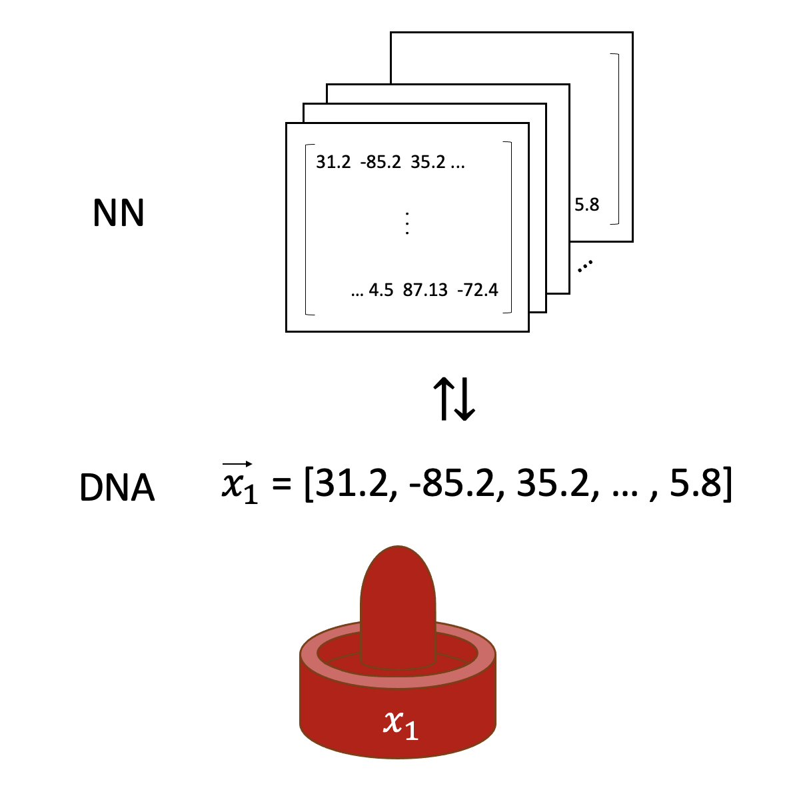
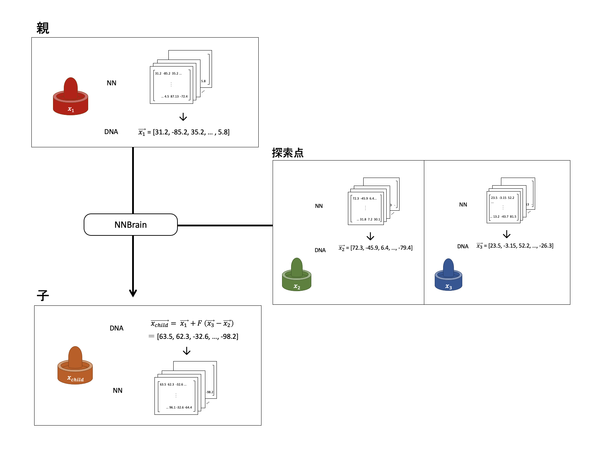

# エアホッケー

## 概要
エアホッケーでは, スマッシャーと呼ばれる器具を用いて盤上のパックを打ち合い, 相手のゴールに入れて得点を競い合います. 今回はAIにスマッシャーのコントールの仕方を学ばせます. \
配布されているプログラムでは, 自分の位置, パックの位置, 敵の位置を入力とし, 自分の動作(速度ベクトル)を出力とし, ニューラルネットワークを差分進化で学習させます.


## ダウンロード
```shell
$ git clone https://github.com/trombiano1/airhockey.proj.git
```
で適当なフォルダにcloneした後、Unity HubのOpenから`airhockey.proj`を選択し開いてください. GitHubにはUnityのライブラリは載せていませんが, Unityで開く際に自動生成されます.

## アルゴリズムの説明
差分進化(Differential Evolution)は1995年に発表されたメタヒューリスティクスであり, 最適化手法の中でも強力な方法のひとつとして知られています. 差分進化では以下のようなアルゴリズムを用います.

0. 個体をランダムな値で初期化します
1. **Mutation**\
   親となる個体x1をランダムに選びます. また, 個体をもう2つランダムに選んで x2, x3 とします
2. **Crossover**\
   差分ベクトル F * (x3 - x2) を計算し, 親 x1 にこの差分ベクトルを足したものを子供とします(Fはスケーリングパラメータと呼ばれる定数です)

   1.と2.を繰り返し, 決められた個数の子供を生成します
   
3. **Selection**\
   個体の親と子を比較し, 優れている方を残します

4. 1.~3.を繰り返します

スケーリングパラメータFが大きいと大ぶりな探索となり, 探索は早くなりますが収束が不安定になります. 差分進化について詳しくは参考文献などを参照してください.

## ソースコードの概要
このプログラムでは個体それぞれが行動を決定するニューラルネットワーク(NN)を持っています. また, NNは1列の実数の配列(DNA)としても保存されています. このDNAをベクトルとして**Crossover**などの演算をしています.



差分進化の管理は`DEEnvironment`が行っています. 

### Mutation, Crossover
まず, `DEEnvironment`が個体1, 個体2, 個体3をランダムに選びます. それぞれのDNAをx1, x2, x3とします.
`DEEnvironment`は`NNBrain`にx1, x2, x3を送り, `NNBrain`がx1 += F * (x3 - x2)を計算します. これが子供のDNAとなります. 



なお, この実験では交叉率`crossrate`が定められており, その割合の子供が新しいDNAを持ちます. その他の子供は親のDNAをそのまま引き継ぎます.

これを繰り返し, 子供を生成していきます. 今は100個の子供を生成する設定になっています.
### 対戦 (Selection)
`DEEnvironment`は`HockeyAgent`を呼んでボードの状態やプレーヤーの位置などの情報を取得してもらい, 情報を`NNBrain`に送ります.　

`NNBrain`は個体のNNの情報を持っており, 受け取ったボードの状態と個体のNNを使ってプレーヤーが次に取るべき行動`action`を計算して返します. このプログラムでは, `action`はプレーヤーの速度ベクトルとして伝えられます.

`DEEnvironment`は返ってきた`action`を`HockeyAgent`に送り, 実際にその行動を取るように指示します.

`HockeyAgent`は受け取った`action`を`HockeyPlayer`に送り, 実際にUnity上でプレーヤーの位置を移動させます.

最後に, `HockeyAgent`はボードの状態をもとに個体に対して報酬を与えます. 報酬の値は現在以下のように決まっています.

- 1フレームごとに, パックの正面にいればいるほど報酬を追加します
- ゴールを決めると大きな報酬(1000)を足します 
- ゴールを決められると大きな報酬(1000)を引きます


この操作を繰り返すことで対戦が進んでいきます. 時間切れになると対戦が止まり, 2つの個体の報酬値が決まります. これを繰り返し, 全ての個体に対して報酬値が決まります.

最後に, 全ての個体について親と子の報酬値を比較し, 子供の方が高い場合は子供, そうでない場合は親のDNAを残します.

### 各コードについての詳細
- `/Assets/Scripts/AI/DEEnvironment.cs`\
AgentとBrainを管理し, 一定期間ごとにAgentとBrainを更新します.

- `/Assets/Scripts/HockeyController/HockeyAgent.cs` \
  ボードの状態を観測し, 必要な情報(自分の位置, 敵の位置, パックと自分の位置の差)を取得します. また, actionを受け取ってHockeyPlayer.csに渡します. ゲームの残り時間も管理します. ボードの状態に従い個体の報酬を管理します.

- `/Assets/Scripts/HockeyController/HockeyPlayer.cs`\
`action`を受け取り, 実際にパックを移動させます. 受け取った`action`は陣地を出る可能性や制限速度を超える可能性があるため, その場合は動きを制限します.

- `/Assets/Scripts/AI/NNBrain.cs`\
ボードの状態を入力として受け取り, NNを使って次に取るべき行動を計算し返します. 

- `/Assets/Scripts/HockeyPlayer/ManualPlayer.cs`\
ManualPlayの時にのみ使われます. キーボードやマウスからの入力に従ってプレーヤーを動かします.

- `/Assets/Scripts/HockeyPlayer/ComputerPlayer.cs`\
ManualPlayの時にのみ使われます. それまでに学習した`NNBrain`のうち最も成績の良かったNNを使ってプレーヤーと対戦します.

- `NEEnvironment`, `NERuntime`, `QEnvironment`, `QBrain`など\
現在使われていません.

## Unity Editor上での操作説明
### Sceneの実行
ProjectタブのAssets > ScenesからHockeyGameをダブルクリックし開きます.


画面上部の再生ボタンを押すと学習が始まります. 再生中にはGame画面に表示されるスライダでプログラムの実行速度を調整できます. コンピュータへの負荷を少なくしたい場合は、描画をオフにすることもできます。


### ManualPlay
ManualPlayがオフであればPlayer1とPlayer2が対決しそれぞれが学習します(Populationが2ずつ増えるのはこれが理由)が, ManualPlayをオンにするとその時点までに学習したNNのうち最も成績が良かったNNが制御する`ComputerPlayer`とプレーヤーがキーボードなどで操作する`ManualPlayer`が対決します.

### パラメータの設定
Hierarchy > Environmentを選択すると, 以下の画面が表示されます.


| パラメータ  | 説明 |
| ------------- | ------------- |
| Total Population  | 1世代ごとの個体数  |
| Mutation Scaling Factor  | スケーリングファクターF(上述)  |
| Cross Rate | 交叉率(上述) |
| Input Size | 入力レイヤの大きさ(6)<br> - 自分のx座標<br> - 自分のz座標<br> - 自分とパックのx座標の差<br> - 自分とパックのz座標の差<br> - 相手のx座標<br> - 相手のz座標 |
| Hidden Size | 隠れレイヤの大きさ |
| Hidden Layers | 隠れレイヤの数 |
| Output Size | 出力レイヤの大きさ(2)<br> - 移動の速度ベクトルのx成分<br> - 移動の速度ベクトルのz成分 |
| N Agents | 2 (同時に対戦するプレーヤー数, 2で固定) |
| Waiting Flag<br>Restart Flag<br>Manual Mode Flag<br> | Agentによって試合の管理に利用される変数です |

また, Hierarchy > Player1, Player2を選択すると, 以下の画面が表示されます.


| パラメータ  | 説明 |
| ------------- | ------------- |
| Max Speed  | プレーヤーの動くことができる速さの上限です. |
| Max Battle Time  | 試合時間の上限です  |

## 困ったら
- 再生ボタンを押しても動かない
  - Agent Speedが0になっているかもしれません. 少し上げてみてください.
- ManualPlayボタンが押せない
  - 学習を始めてしばらく経ってから押してみてください.
- ManualPlayでパックを動かせない
  - 使用できるキーは矢印キーではなくWASDです.
